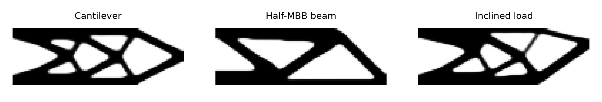
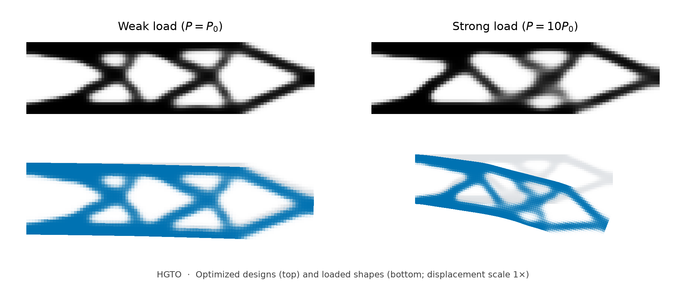

# HGTO

**A Unified Graph-Based Physics-Informed Formulation for Structural Topology Optimization**

Kangzheng Liu · Uday Kumar Punna · Leixin Ma

**Paper:** arXiv — link coming soon.
<!-- Replace the placeholder above with the arXiv abstract URL once available. -->

HGTO couples a graph neural network for material density with finite-element-consistent hypergraph mechanics. Each design is optimized from a uniform density field without labeled topology data. The same formulation supports planar and spatial elasticity, irregular domains, finite deformation, and elastoplastic loading histories.



## Installation

Use Python 3.11 or newer. Install the appropriate [PyTorch distribution](https://pytorch.org/get-started/locally/) for your CPU or CUDA environment, then:

```bash
git clone https://github.com/Liukz233/HGTO.git
cd HGTO
python -m pip install -e ".[test,plot]"
```

Optional components:

| Extra | Purpose |
|---|---|
| `fast-cpu` | PARDISO solver used by the paper's linear SIMP--OC configurations |
| `gpu-sparse` | cuDSS 0.8 for GPU nonlinear mechanics; requires CUDA 12 |
| `mesh` | Regenerate irregular meshes with Gmsh; saved meshes are already included |
| `dev` | Tests and source formatting checks |

For the GPU nonlinear examples and all paper baselines:

```bash
python -m pip install -e ".[fast-cpu,gpu-sparse]"
```

NTopo runs in a separate TensorFlow environment; see [baseline setup](docs/baselines.md).

## Quick start

Run a small CPU example, plot its density, and independently evaluate it:

```bash
hgto run --config configs/smoke/cantilever_cpu.yaml --output runs/demo
hgto plot runs/demo --output runs/demo/topology.png
hgto evaluate runs/demo
```

This four-update example checks installation; it is not a converged paper result. Output directories must be new. `python -m hgto` provides the same commands as `hgto`.

Run the paper's standard cantilever:

```bash
hgto run --config configs/linear2d/cantilever_120x40.yaml --output runs/cantilever/hgto
hgto run --config configs/linear2d/cantilever_120x40.yaml --method oc --output runs/cantilever/oc
```

HGTO paper configurations use `cuda:0`. Add `--device cpu` for CPU execution. To inspect a configuration without computing or writing results, add `--dry-run`.

## Paper experiments

[Reproduction instructions](docs/reproduction.md) map every reported experiment to its configuration, baseline, and reference metrics.

| Study | Configurations |
|---|---|
| Standard beams and high resolution | [`configs/linear2d`](configs/linear2d) |
| L bracket and perforated bracket | [`configs/domains`](configs/domains) |
| 3D cantilever, four-foot support, torsion | [`configs/linear3d`](configs/linear3d) |
| Large-deformation cantilever and bridge | [`configs/nonlinear`](configs/nonlinear) |
| Elastic versus plastic connection design | [`configs/nonlinear`](configs/nonlinear) |



HGTO designs under weak and strong loading. Blue shows the loaded shape at the actual displacement scale; gray shows the undeformed design. The reference load is $P_0 = 0.00125$.

## Repository layout

```text
src/hgto/
  cli.py                 Public commands
  linear.py              Linear design and independent evaluation
  optimization.py        Graph density optimization with Adam
  topopt/                Graph layers, features, density filtering and projection
  fem/                   Mesh operators, constitutive laws and equilibrium solvers
  reference/             Independent elasticity and SIMP--OC
  linear2d/, linear3d/    Planar and spatial problem/physics utilities
  domains/, case_studies/ Irregular meshes and paper problem definitions
  nonlinear/             Incremental mechanics, design, and response evaluation
  baselines/ntopo/       Isolated NTopo adapter
configs/                 Named, reproducible experiment settings
meshes/                  The two paper irregular-domain meshes
scripts/                 Batch reproduction and NTopo launchers
benchmarks/reference/    Recorded paper metrics, not outputs of a fresh run
tests/                   Mechanics, gradients, constraints, solvers and CLI checks
third_party/ntopo/       Pinned upstream source and its original MIT license
```

See [architecture](docs/architecture.md), [output files](docs/outputs.md), and [numerical settings](docs/reproduction.md). Generated histories, checkpoints, plots, and local experiment logs belong under the ignored `runs/` directory.

## Validation

```bash
python -m pytest
```

The default suite uses small problems. CUDA/cuDSS and PARDISO checks run when those optional components are available. Tests cover physical-volume gradients, independent state/sensitivity agreement, continuation and stopping, nonlinear adjoints, and the installed command-line workflow.

## Citation and license

Please cite the accompanying manuscript:

> Kangzheng Liu, Uday Kumar Punna, and Leixin Ma. *HGTO: A Unified Graph-Based Physics-Informed Formulation for Structural Topology Optimization*. 2026.

Machine-readable citation metadata is in [CITATION.cff](CITATION.cff). HGTO is distributed under the [MIT license](LICENSE). NTopo retains its original license; see [third-party notices](THIRD_PARTY.md).
